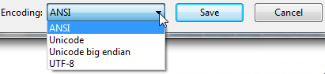

# R repo

Experimental code to learn R programming.

Useful link 

[course](https://www.youtube.com/watch?v=tfN10IUX9Lo)

Remember to launch shiny::runApp() in the Debug Console.

Note: an intersting technique to determine e.g. fileEncoding="UTF-16LE" is to save via old vanilla Windows Notepad.  



Reactives

define a rule how something is calculated

```r
output <- > reactive({
    1+input$n
})
```
a great example to picture the concept behind is  

```r
output <-  reactive({
    #
})
```

Observe/Observe Events

monitor one/several reactive values. Reexecute the code when some reative values changes.

| reactive()     | observeEvents()| Città          |
|----------------|----------------|----------------|
| Mario Rossi    | 30             | Roma           |
| Anna Bianchi   | 25             | Milano         |
| Luca Verdi     | 35             | Napoli         |