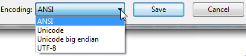

# R repo

Experimental code to learn R programming.

Useful link 

[course](https://www.youtube.com/watch?v=tfN10IUX9Lo)

Remember to launch shiny::runApp() in the Debug Console.

Note: an intersting technique to determine e.g. fileEncoding="UTF-16LE" is to save via old vanilla Windows Notepad.  

# Random Walk

In mathematics, a random walk is a random process that describes a path that consists of a succession of random steps on some mathematical space.

An elementary example of a random walk is the random walk on the integer number line {\displaystyle \mathbb {Z} }\mathbb {Z}  which starts at 0, and at each step moves +1 or −1 with equal probability. Other examples include the path traced by a molecule as it travels in a liquid or a gas (see Brownian motion), the search path of a foraging animal, or the price of a fluctuating stock and the financial status of a gambler.